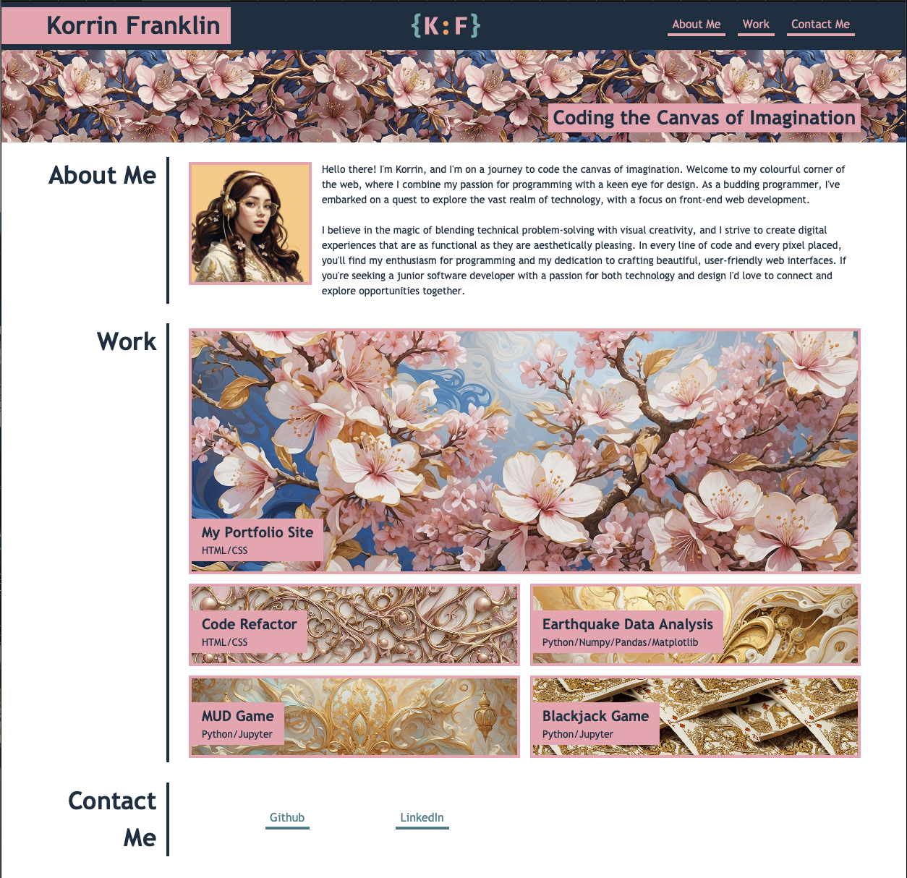
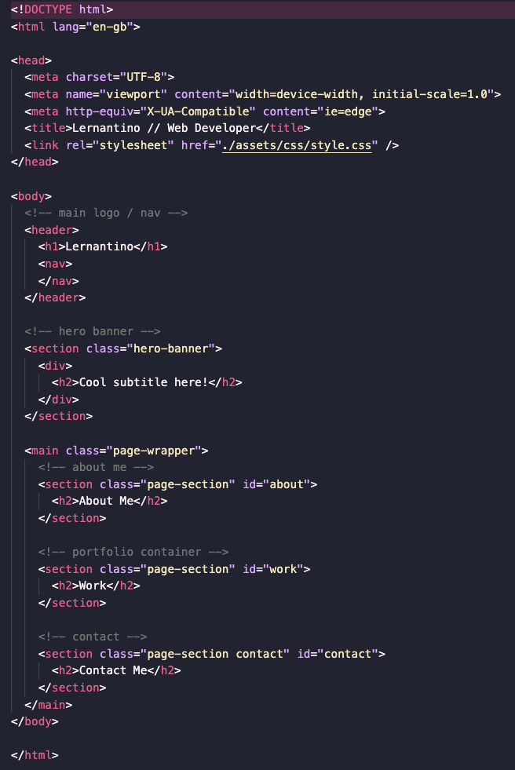
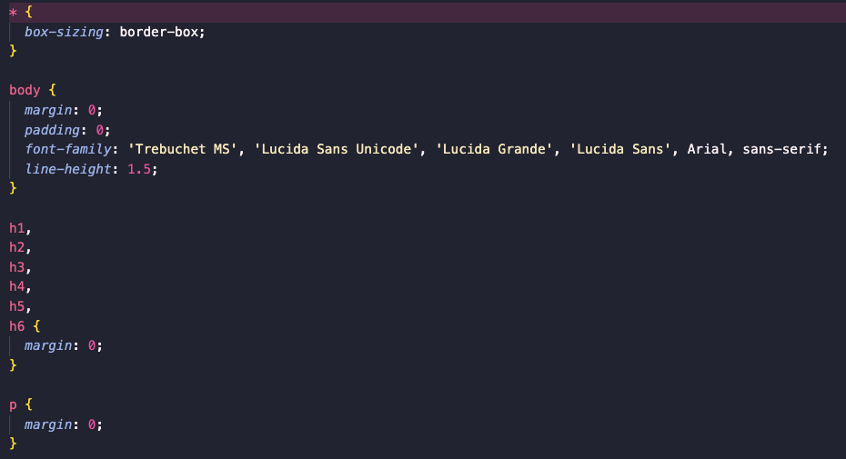

# Korrin Franklin - Portfolio Website

## Description 
This is my portfolio website showcasing links to my 5 best personal and group projects. I programmed the entire site with responsiveness in mind. I had a mockup and some starter code to follow (see credits section) the rest of the build was of my own design. 

## Usage 

- The navigation links will take you to the corresponding sections of the website. 
- The work section contains 5 images that are links to my personal and group projects. Some links will direct you to the corresponding github repo and others to the diployed website. 
- The contacts section contains further links to both my github and ways of communicating with me. 
- View my deployed [Portfolio](https://korrin-f.github.io/portfolio/) <- here

## Credits

EDx Front-end Web-dev bootcamp provided this moc-up to follow:

And the following starter HTML and CSS:

## License

See the licence in the repo.

## Badges

 / HTML